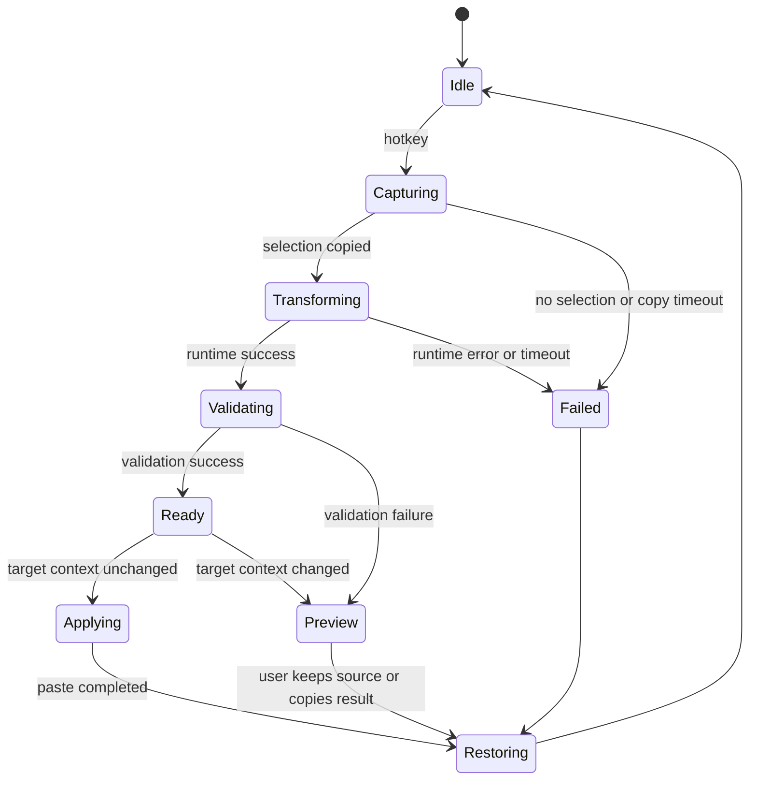

# Clipboard State Machine

The macOS client coordinates selection capture and replacement without damaging
the user's clipboard or pasting into a different context.

## Captured state

- Original clipboard contents and change count
- Selected source text
- Active application identity
- Target window or accessibility identity when available
- Transformation request ID
- Invocation timestamp

## Safety conditions

- Only one automatic replacement request may be active at a time.
- Paste is allowed only when the target application and available context still
  match the captured state.
- A clipboard change made by the user during inference must not be silently
  overwritten.
- Restoration must account for the clipboard change count and ownership.
- Every timeout and error path must converge on a safe state.

Initial prototypes may use synthetic `Cmd+C` and `Cmd+V` events. Direct
Accessibility access can be evaluated later for applications where event-based
capture is unreliable.
