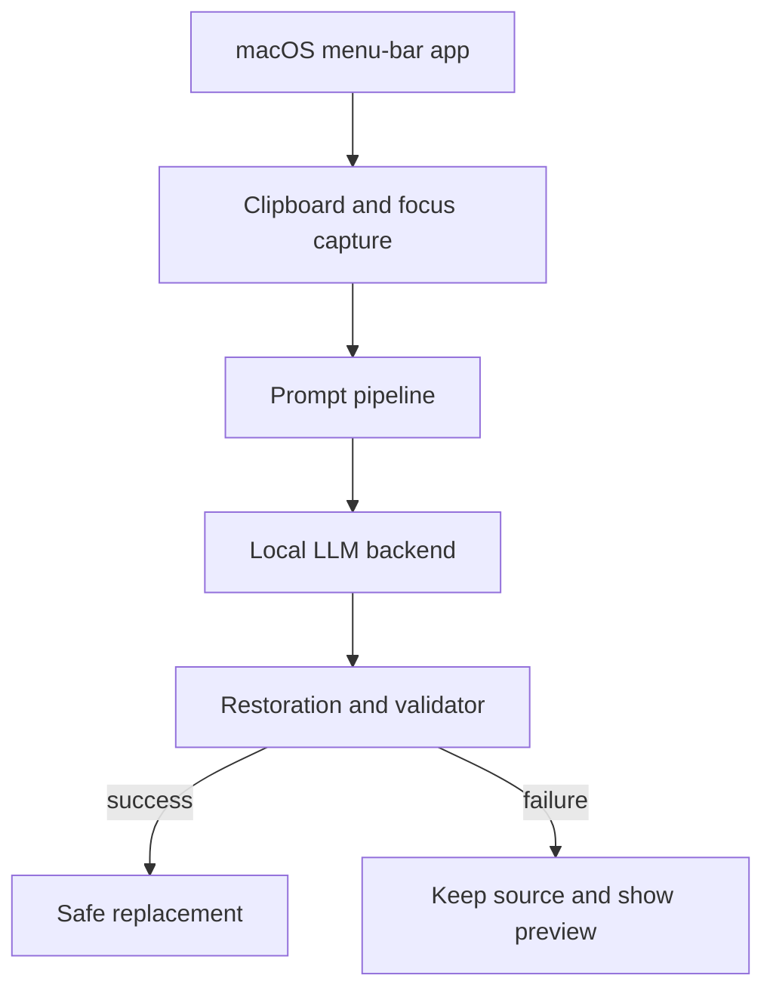

# System Overview

PromptBridge consists of a macOS client, a prompt-processing pipeline, a local
LLM backend, and deterministic preservation validation.

## macOS client

The client owns global hotkeys, clipboard backup and restoration, keyboard
events, active-application checks, preview UI, settings, permissions, timeouts,
and user-facing errors. The likely implementation is Swift and SwiftUI using
`NSPasteboard`, `CGEvent`, `AXUIElement`, `NSPanel`, and `NSStatusItem`.

## Prompt processing

The processing layer segments text, extracts protected elements, constructs a
mode-specific request, calls the configured backend, restores protected values,
and invokes validation. See [Prompt Pipeline](prompt-pipeline.md).

## Local LLM backend

The backend boundary must allow runtime implementations to change without
coupling transformation or validation logic to a specific server. Ollama is the
initial proposed MVP runtime; see [ADR-0002](../decisions/ADR-0002-ollama-mvp.md).

## Validator

The validator is deterministic wherever possible and decides whether automatic
application is allowed. It reports structured failures rather than a single
boolean. See [Preservation Validator](preservation-validator.md).
