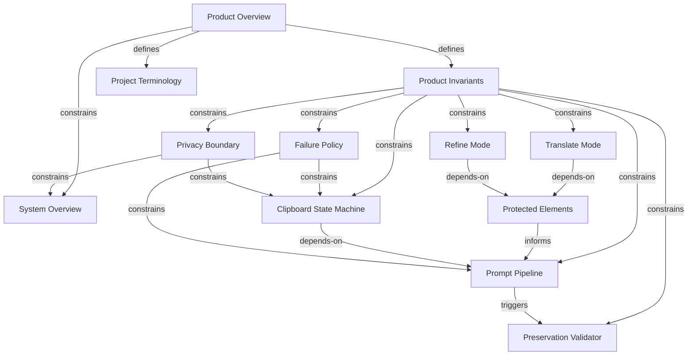
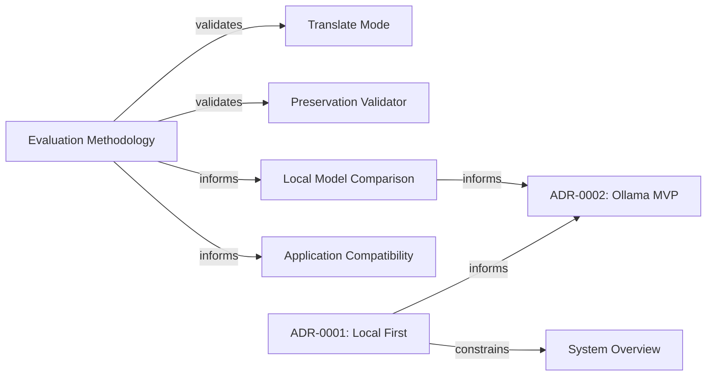
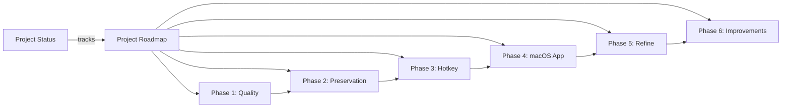

# Generated Knowledge Graph

This view is derived from canonical document frontmatter. It provides a compact
overview; canonical frontmatter remains the complete relation source. The
[`document-index.json`](document-index.json) file maps stable IDs to paths.

## Product and architecture



## Evaluation and decisions



## Roadmap



## Development tooling

```mermaid
graph LR
    precommit["Pre-commit Conventions"] -->|"validates"| graph["Knowledge Graph"]
    precommit -->|"informs"| status["Project Status"]
    commit["Commit Convention"] -->|"part-of"| precommit
    style["Code Documentation Convention"] -->|"part-of"| precommit
    skills["Agent Workflow Skills"] -->|"depends-on"| precommit
    skills -->|"related-to"| status
    index["Documentation Index"] -->|"related-to"| precommit
    index -->|"related-to"| commit
    index -->|"related-to"| style
    index -->|"related-to"| skills
```
